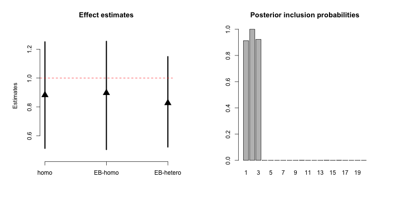
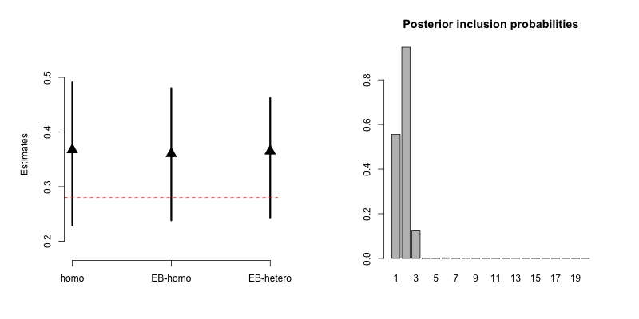
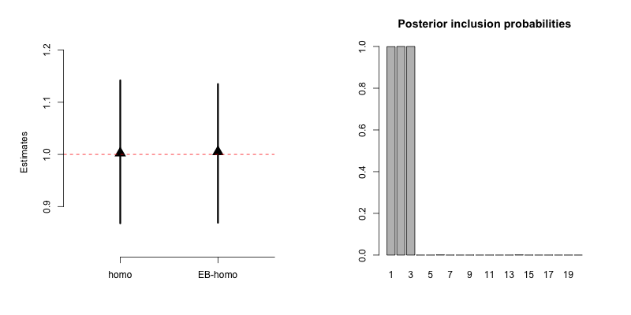
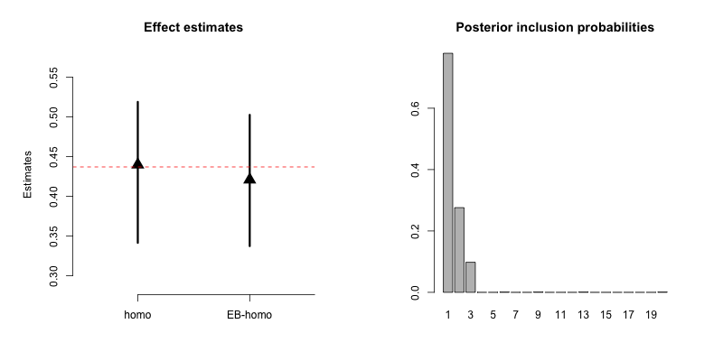

# HDconfounding

This repository is an R package to implement the methods in "High-dimensional confounding adjustment using continuous spike and slab priors" by Joseph Antonelli, Giovanni Parmigiani, and Francesca Dominici.
The paper can be found at the following link:

https://arxiv.org/pdf/1704.07532.pdf

Currently, the software only allows for fully Bayesian inference with MCMC, but we are in the process of writing software that also estimates posterior modes of treatment effects. This will not provide valid measures of uncertainty, but will estimate quantities with much less computation time and will allow for automatic confounder selection as some confounders will have coefficients hard thresholded to zero. If you have any questions regarding the software don't hesitate to contact Joseph Antonelli at jantonelli111@gmail.com, and please report any bugs that you find!

# How to use the HDconfounding

In this section we will show you how to use the main functions of the HDconfounding R package. We will simulate data under both a binary and continuous outcome and show how to analyze them using the various functions in the package. Throughout we will use a sample size of $$n=200$$ and p=200. In general the software will work for larger sample sizes and covariate dimensions, however, we the code might take substantially longer for covariate dimensions in the thousands. 

### Loading and building the package

To build the package the user must install the devtools R package and then run the following code.

```
library(devtools)
install_github(repo = "jantonelli111/HDconfounding")
library(HDconfounding)
```

# Binary treatments

### Continuous outcome, homogeneous treatment effect

First let's generate some data to practice estimating treatment effects with:

```{r, eval=TRUE}
n = 200
p = 200
x = matrix(rnorm(n*p), n, p)
z = rbinom(n, 1, p=pnorm(0.7*x[,1] + 0.3*x[,2]))
y = rnorm(n, mean=z + 0.3*x[,1] + 0.6*x[,2] + 0.5*x[,3], sd=1)
```

So our sample size is 200, we have 200 covariates, the first 2 covariates are important for confounding adjustment, and the 3rd covariate is a predictor of the outcome. In this case, the treatment effect is homogeneous, i.e does not vary for different values of the covariates. We will now estimate it using both the homogeneous and heterogeneous versions of our approach. Both should yield unbiased answers in this setting, though we expect the heterogeneous approach to be slightly less efficient as it is a more complex model with more parameters.

First, to estimate the homogeneous treatment effect we can run the following

```{r, eval=TRUE}
sslEB = SSL(y=y, z=z, x=x, nScans=3000, burn=1000, thin=2, lambda0="EB")
```

This model estimates the tuning parameter $\lambda_0$ with empirical Bayes. We recommend this as it is difficult to have prior knowledge about what value this parameter should take. If the user wants to specify their own value of $\lambda_0$, then weight must also be provided (w in the main manuscript) and we recommend a value of 0.05.

```{r, eval=TRUE}
ssl = SSL(y=y, z=z, x=x, nScans=3000, burn=1000, thin=2, lambda0=15, weight = 0.05)
```

The empirical Bayes estimate is calculated using MCMC so the running time is a little longer than pre-selecting $\lambda_0$, which is one reason one might want to choose their own value if they have a large data set. It is important to note though that a poorly chosen value of $\lambda_0$ can lead to poor estimation so we highly recommend the EB option. 


### Continuous outcome, heterogeneous treatment effect

Now let's analyze the same data, but allowing for heterogeneous treatment effects. 

```{r, eval=TRUE}
sslEBhetero = SSLhetero(y=y, z=z, x=x, nScans=3000, burn=1000, thin=2, lambda0="EB")
```

We can plot the estimates and intervals to compare the three models we have run. The red line is the truth. We also plot here the posterior inclusion probabilities for each of the p covariates.

```{r, eval=TRUE, fig.height=6, fig.width=6}
estimates = c(ssl$TreatEffect, sslEB$TreatEffect, 
              sslEBhetero$TreatEffect)
CIlower = c(ssl$TreatEffectCI[1], sslEB$TreatEffectCI[1], 
            sslEBhetero$TreatEffectCI[1])
CIupper = c(ssl$TreatEffectCI[2], sslEB$TreatEffectCI[2],
            sslEBhetero$TreatEffectCI[2])

par(mfrow=c(1,2), pty='s')

## plot effect estimates
plot(1:3, estimates, pch=17, cex=2, ylim = range(c(CIlower, CIupper)) + c(-0.05, 0.05),
     xlab="", ylab="Estimates", axes=FALSE, main="Effect estimates")
segments(x0 = 1:3, x1=1:3, y0=CIlower, y1=CIupper, lwd=3)
abline(h = 1, lty=2, col="red")
axis(2)
axis(1, at=1:3, c("homo", "EB-homo", "EB-hetero"))

## plot posterior inclusion probabilities (for first 20 covariates for brevity)
barplot(sslEB$gammaPostMean[1:20], main="Posterior inclusion probabilities", names.arg=1:20)
```




### Binary outcomes

First let's generate some data to practice estimating treatment effects with:

```
n = 200
p = 200
x = matrix(rnorm(n*p), n, p)
z = rbinom(n, 1, p=pnorm(0.7*x[,1] + 0.3*x[,2]))
y = rbinom(n, 1, p=pnorm(z + 0.3*x[,1] + 0.6*x[,2] + 0.5*x[,3]))
```

First, to estimate the homogeneous treatment effect we can run the following

```
sslEBBinary = SSLBinary(y=y, z=z, x=x, nScans=3000, burn=1000, thin=2, lambda0="EB")
```

Or without empirical Bayes

```
sslBinary = SSL(y=y, z=z, x=x, nScans=3000, burn=1000, thin=2, lambda0=15, weight = 0.01)
```

Or allowing for heterogeneous treatment effects (using empirical Bayes again)

```
sslEBheteroBinary = SSLheteroBinary(y=y, z=z, x=x, nScans=3000, burn=1000, thin=2, lambda0="EB")
```

We can plot the estimates and intervals to compare the three models we have run. The red line is the truth.
```
estimatesBinary = c(sslBinary$TreatEffect, sslEBBinary$TreatEffect, 
                    sslEBheteroBinary$TreatEffect)
CIlowerBinary = c(sslBinary$TreatEffectCI[1], sslEBBinary$TreatEffectCI[1], 
                  sslEBheteroBinary$TreatEffectCI[1])
CIupperBinary = c(sslBinary$TreatEffectCI[2], sslEBBinary$TreatEffectCI[2], 
                  sslEBheteroBinary$TreatEffectCI[2])
                  
par(mfrow=c(1,2), pty='s')

## plot the effect estimates
plot(1:3, estimatesBinary, pch=17, cex=2, ylim = range(c(CIlowerBinary, CIupperBinary)) + c(-0.05, 0.05),
xlab="", ylab="Estimates", axes=FALSE)
segments(x0 = 1:3, x1=1:3, y0=CIlowerBinary, y1=CIupperBinary, lwd=3)
abline(h = 0.28, lty=2, col="red")
axis(2)
axis(1, at=1:3, c("homo", "EB-homo", "EB-hetero"))

## plot posterior inclusion probabilities
barplot(sslEBBinary$gammaPostMean, main="Posterior inclusion probabilities", names.arg=1:p)

```




# Continuous treatment

Using the methods for a continuous treatment are very similar to those for the binary treatment, so we briefly detail them here. 

### continuous outcomes

For continuous outcomes, the methods are almost identitical to those for binary outcomes. The only difference is that you can't use the heterogeneous treatment effect feature.

```
n = 200
p = 200
x = matrix(rnorm(n*p), n, p)
z = rnorm(n, mean=0.7*x[,1] + 0.3*x[,2])
y = rnorm(n, mean=z + 0.3*x[,1] + 0.6*x[,2] + 0.5*x[,3], sd=1)

sslEB = SSL(y=y, z=z, x=x, nScans=3000, burn=1000, 
            thin=2, lambda0="EB", z_type="continuous")
ssl = SSL(y=y, z=z, x=x, nScans=3000, burn=1000, 
          thin=2, lambda0=15, weight = 0.01, z_type="continuous")

estimates = c(ssl$TreatEffect, sslEB$TreatEffect)
CIlower = c(ssl$TreatEffectCI[1], sslEB$TreatEffectCI[1])
CIupper = c(ssl$TreatEffectCI[2], sslEB$TreatEffectCI[2])
```

And now we can again plot the results.

```
par(mfrow=c(1,2), pty='s')
plot(1:2, estimatesBinary, pch=17, cex=2, ylim = range(c(CIlowerBinary, CIupperBinary)) + c(-0.05, 0.05),
     xlab="", ylab="Estimates", axes=FALSE, xlim=c(0.5, 2.5), main="Effect estimates")
segments(x0 = 1:2, x1=1:2, y0=CIlowerBinary, y1=CIupperBinary, lwd=3)
axis(2)
axis(1, at=1:3, c("homo", "EB-homo", "EB-hetero"))

## plot posterior inclusion probabilities
barplot(sslEB$gammaPostMean, main="Posterior inclusion probabilities", names.arg=1:p)
```


You get an error message if you try to use the heterogeneous version of the functions

```
try({
  SSLhetero(y=y, z=z, x=x, nScans=300, burn=100, thin=2, lambda0="EB")
})
```


### binary outcomes

There are slight differences when using a continuous treatment and a binary outcome. The reason for this is that the treatment effect depends on other covariates and the value of the treatment itself. One example is that the treatment effect going from z=0 to z=1 is not the same as from z=1 to z=2, etc. When using our programs with a binary outcome and a continuous treatment, you must also specify which two values you want to compare.

First let's generate some data:

```{r, eval=TRUE}
n = 200
p = 200
x = matrix(rnorm(n*p), n, p)
z = rnorm(n, mean=0.7*x[,1] + 0.3*x[,2])
y = rbinom(n, 1, p=pnorm(z + 0.3*x[,1] + 0.6*x[,2] + 0.5*x[,3]))
```

Now we can analyze it, but notice we have now added a parameter called comparison_groups

```{r, eval=TRUE}
sslEB = SSLBinary(y=y, z=z, x=x, nScans=3000, burn=1000, thin=2, 
                  lambda0="EB", z_type="continuous", comparison_groups = c(2,0))
ssl = SSLBinary(y=y, z=z, x=x, nScans=3000, burn=1000, thin=2, lambda0=15, 
                weight = 0.01, z_type="continuous", comparison_groups = c(2,0))
```

This parameter tells us essentially what estimand we're interested in. In the case of a binary treatment it is always (1,0) because we're comparing treated to controls. When we have continuous treatments, we need to specify the two values of the treatment we are comparing. In this case we chose 2 and 0, so our code will output estimates of $E(Y^2 - Y^0)$

```
estimatesBinary = c(sslBinary$TreatEffect, sslEBBinary$TreatEffect)
CIlowerBinary = c(sslBinary$TreatEffectCI[1], sslEBBinary$TreatEffectCI[1])
CIupperBinary = c(sslBinary$TreatEffectCI[2], sslEBBinary$TreatEffectCI[2])

par(mfrow=c(1,2), pty='s')
plot(1:2, estimatesBinary, pch=17, cex=2, ylim = range(c(CIlowerBinary, CIupperBinary)) + c(-0.05, 0.05),
     xlab="", ylab="Estimates", axes=FALSE, xlim=c(0.5, 2.5), main="Effect estimates")
segments(x0 = 1:2, x1=1:2, y0=CIlowerBinary, y1=CIupperBinary, lwd=3)
axis(2)
axis(1, at=1:3, c("homo", "EB-homo", "EB-hetero"))
abline(h = 0.437, lty=2, col="red")

## plot posterior inclusion probabilities
barplot(sslEBBinary$gammaPostMean, main="Posterior inclusion probabilities", names.arg=1:p)
```


**References**

Joseph Antonelli, Giovanni Parmigiani, and Francesca Dominici. **High-dimensional confounding adjustment using continuous spike and slab priors**. 2017. arXiv:1704.07532

